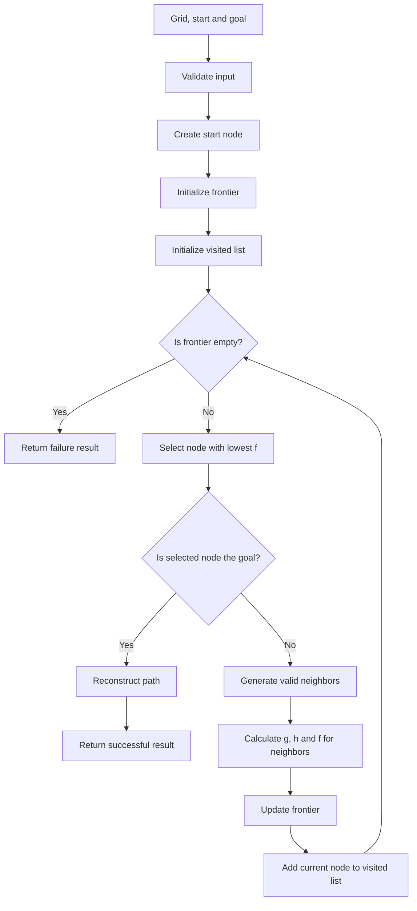
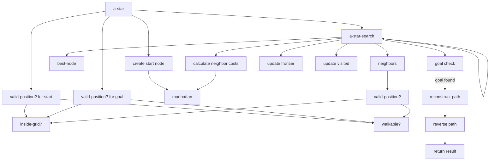
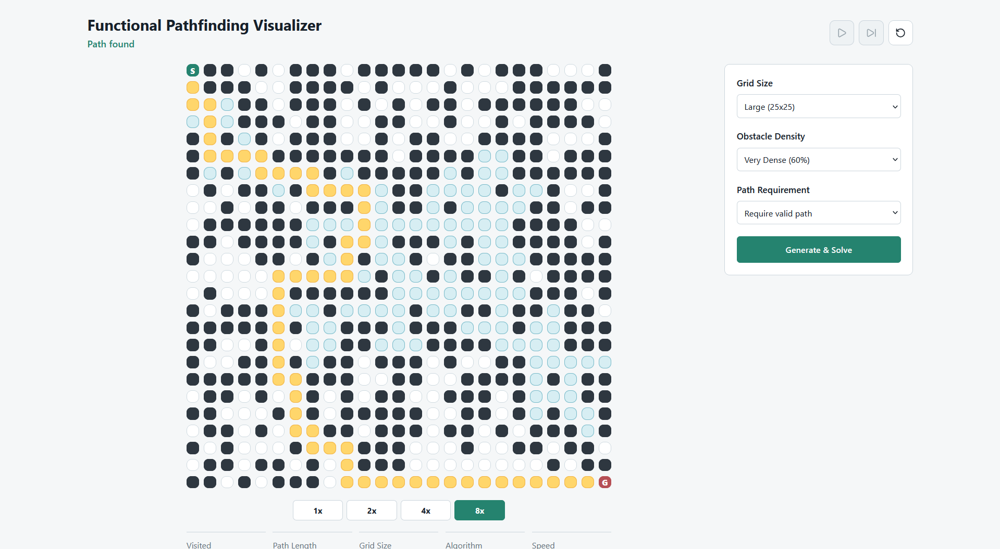
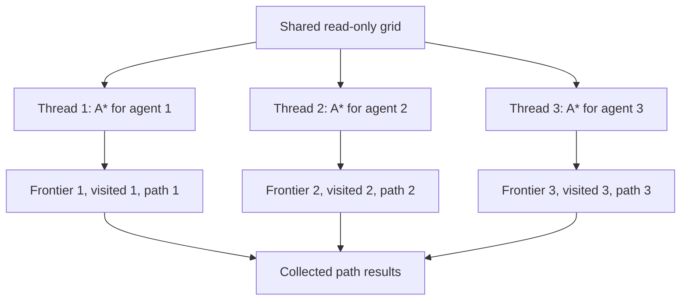

# Evidence: Demonstration of a Programming Paradigm

## Functional Pathfinding Visualizer

Author: Alexis Yaocalli Berthou Haas  
Course: TC2037 - Programming Paradigms  
Date: May 21, 2026  

## Introduction

Functional Pathfinding Visualizer implements the A* search algorithm to solve a pathfinding problem inside a grid. The objective is to move from a start position to a goal position while avoiding obstacles, using only horizontal and vertical movement. The search is implemented in Scheme/Racket, while the result is displayed through a React visualizer that animates the explored cells and the final path.

The main design decision is to keep computation and presentation separate. Scheme/Racket is responsible for the actual search: it receives the grid, validates the start and goal positions, explores possible routes, keeps track of the frontier and visited cells, and returns a structured result. React is responsible for showing that result in a more understandable way, but it does not decide where the path goes. This separation is important because it means that the algorithm can be tested and explained independently from the interface.

The project follows the functional programming paradigm because A* can be described naturally as a transformation of data. The grid becomes a set of possible positions, each position can become a node with costs, and the search advances by updating the frontier, the visited list and the parent links that make path reconstruction possible. This makes the algorithm easier to follow because each important decision is represented through a function with a clear responsibility, instead of being hidden inside a larger object or mixed with the visual layer.

## Problem definition

The problem consists of finding a valid route between two points in a grid. Each cell is either free or blocked, and the agent can only move up, down, left or right. A valid solution must start at the initial cell, end at the goal cell, stay inside the boundaries of the grid, avoid obstacles and move only through adjacent cells.

| Symbol | Meaning |
|---|---|
| S | Start position |
| G | Goal position |
| 0 | Free cell |
| 1 | Obstacle |

Example grid:

```text
S 0 0 1 0
0 1 0 1 0
0 1 0 0 G
0 0 0 1 0
```

This problem is useful because it represents a simplified version of something that appears in many computational contexts: videogames, map systems, robotics and simulations all require agents to navigate spaces with restrictions. The grid is intentionally simple, but the reasoning is still meaningful because the algorithm must evaluate alternatives, reject invalid moves and choose which position is worth exploring next.

## Functional programming

Functional programming is a programming paradigm that organizes programs around functions and the values those functions produce. Instead of thinking mainly in terms of variables that change step by step, the programmer thinks in terms of transformations: a function receives input, processes it and returns a result. This does not mean that the program becomes automatically simpler, but it gives the solution a structure that is easier to reason about when each function has a clear purpose.

The roots of functional programming are connected to lambda calculus, introduced by Alonzo Church in the 1930s as a formal way to study computation through function abstraction and application (Church, 1936). This project does not require writing lambda expressions directly, but that influence matters because it explains why functions are treated as central building blocks in functional languages. A function is not only a piece of syntax; it is a named computation that can be understood, tested and reused.

A key idea in functional programming is predictability. When a function receives the same input, it should return the same output without depending on hidden changes somewhere else in the program. For example, a Manhattan distance function receives two positions and returns a number. It does not need to modify the grid, update the visualizer or store a global value to do its job.

```racket
(define (manhattan a b)
  (+ (abs (- (first a) (first b)))
     (abs (- (second a) (second b)))))
```

This style is useful because it makes each part of the program easier to check. If the Manhattan distance function is wrong, that error can be tested directly. If the neighbor generation is wrong, that part can also be isolated. Abelson, Sussman and Sussman (1996) explain that procedures help build abstractions by giving names to computational processes, and this is exactly what happens in the implementation: each function names one part of the pathfinding logic instead of leaving all decisions inside one long block of code.

Hughes (1989) argues that functional programming supports modularity because programs can be built by combining smaller parts. In this project, that modularity is important because pathfinding has several possible points of failure. The algorithm may generate an invalid neighbor, step outside the grid, cross an obstacle, select the wrong node from the frontier or reconstruct the path in the wrong order. A functional structure does not remove those risks by itself, but it makes them easier to locate because the responsibilities are separated.

## Why the functional paradigm fits A*

A* fits the functional paradigm because the algorithm can be understood as a repeated transformation of a search state. The search state includes the current node, the frontier, the visited list, the goal and the parent information needed to rebuild the path. The frontier is the group of nodes that have already been discovered but have not been fully explored yet; in simple terms, it works like the algorithm's waiting list. At each step, A* selects one node from that waiting list, expands it and produces an updated version of the search state.

This way of thinking matches functional programming because the algorithm does not need to hide its progress inside an object with internal mutable state. The progress is visible in the data being passed from one function to another. One function validates positions, another generates neighbors, another calculates the heuristic, another selects the best node, and the recursive search connects those decisions into a complete process. The result is not only a working algorithm, but a solution whose reasoning can be followed from input to output.

The functional paradigm is especially useful here because it supports clarity before optimization. A* can be implemented with more efficient data structures, such as a priority queue, but the first version uses a list for the frontier because that makes the logic easier to explain. This choice has a performance cost, which is analyzed later, but it also makes the algorithm more transparent: the reader can see how nodes are selected, how neighbors are added and how the final path is reconstructed.

## A* algorithm

A* is an informed search algorithm. It is called informed because it uses a heuristic, which is an estimate that helps the algorithm decide which option seems more promising. Hart, Nilsson and Raphael (1968) introduced A* as a formal way to use heuristic information in graph search. The important idea is that the algorithm does not choose the next node randomly, and it also does not choose only based on how far it has already traveled. It combines the cost already accumulated with an estimate of the cost still missing.

The decision formula is:

```text
f(n) = g(n) + h(n)
```

| Value | Meaning |
|---|---|
| g(n) | Real cost from the start to node n |
| h(n) | Estimated cost from node n to the goal |
| f(n) | Estimated total cost of a path that passes through node n |

This formula is useful because it balances two different questions. The value `g(n)` asks how much it has cost to reach the current node, while `h(n)` asks how far that node seems to be from the goal. The value `f(n)` combines both answers, so A* can choose the node that appears to offer the best complete route rather than focusing only on what already happened or only on what appears closest.

For this project, the heuristic is Manhattan distance:

```text
h = |current_row - goal_row| + |current_col - goal_col|
```

Manhattan distance is appropriate because the agent only moves vertically and horizontally. If the current position is `(1, 2)` and the goal is `(4, 6)`, the estimated distance is `7`, because the agent would need three vertical movements and four horizontal movements if there were no obstacles. The heuristic does not know the full map solution in advance; it only gives the search a useful direction. Russell and Norvig (2022) explain that heuristics help reduce unnecessary exploration by guiding the search toward more promising areas of the state space.

The algorithm begins by validating the start and goal positions. Then it creates the start node and places it in the frontier. While the frontier still has nodes, A* selects the node with the lowest `f` value. If that node is the goal, the path is reconstructed by following parent links. If it is not the goal, the algorithm generates valid neighbors, calculates their `g`, `h` and `f` values, updates the frontier and adds the current node to the visited list. When the frontier becomes empty, the algorithm reports that no path exists.

## Data model

The grid is represented as a list of lists. Each internal list represents one row of the map.

```racket
'((0 0 0 1 0)
  (0 1 0 1 0)
  (0 1 0 0 0)
  (0 0 0 1 0))
```

A position is represented as a pair of values, where the first value is the row and the second value is the column.

```racket
'(row col)
```

A node stores the information A* needs in order to compare possible routes and reconstruct the final path.

```racket
(struct node (position g h f parent) #:transparent)
```

| Field | Purpose |
|---|---|
| position | The cell represented by the node |
| g | Cost from the start to this node |
| h | Estimated cost from this node to the goal |
| f | Total estimated cost, calculated as `g + h` |
| parent | Previous node used to rebuild the path |

The parent field is essential because reaching the goal is not enough. The program must also return the route that led there. Once the goal node is found, the path is recovered by following parent links backward and then reversing the result so the route appears from start to goal.

## Functional data flow

The following diagram shows how the A* process moves from input to result. It focuses on the internal logic of the algorithm rather than the visual interface.



This flow matters because it shows the main functional idea of the implementation: the algorithm advances by updating data. The frontier and visited list are not hidden implementation details. They are the visible state of the search, and the recursive process repeatedly receives them, transforms them and continues until it reaches either success or failure.

## Function call flow

The next diagram shows how the main functions relate to each other. It is useful because it connects the conceptual explanation of A* with the actual structure of the implementation.



This diagram shows that the functions are not isolated fragments. They form a chain of responsibility. Validation protects the algorithm from invalid input, neighbor generation controls movement, cost calculation gives A* its decision rule, frontier updates keep the search moving, and path reconstruction turns the final node into a usable answer.

## Implementation overview

The implementation is intentionally direct. Most functions use basic definitions and clear names because the point is not to make the code appear more advanced than necessary; the point is to make the algorithm understandable and correct. The program first receives or generates a grid, validates the start and goal positions, creates the start node, initializes the frontier and then begins the recursive A* search.

The recursive search is the center of the implementation. It checks whether the frontier is empty, selects the best node, verifies whether the goal has been reached and either reconstructs the path or continues exploring. When the search continues, it generates valid neighbors, calculates their costs and updates the frontier and visited list. This structure keeps the implementation close to the logic of the algorithm described earlier.

The implementation uses a list for the frontier. This makes `best-node` easy to understand because it scans the list and selects the node with the lowest `f` value. The disadvantage is that scanning the frontier repeatedly becomes expensive as the grid grows. This tradeoff is acceptable in the current version because the project values a clear functional implementation, but it also explains why a priority queue would be a strong future improvement.

The output is structured so it can support both testing and visualization. A successful result includes the final path and the visited cells, while a failure result indicates that no path exists and returns an empty path.

```json
{
  "success": true,
  "start": [0, 0],
  "goal": [2, 4],
  "visited": [[0, 0], [0, 1], [0, 2], [1, 2]],
  "path": [[0, 0], [0, 1], [0, 2], [1, 2], [2, 2], [2, 3], [2, 4]]
}
```

## Connection with the visualizer

The visualizer makes the algorithm easier to observe. It displays the grid, the obstacles, the visited cells and the final path. It also lets the user change parameters such as grid size, obstacle density, path requirement, backend and playback speed. These controls are not part of the A* logic, but they make it possible to test and demonstrate different scenarios quickly.

The path requirement options create three useful cases. A random grid shows normal behavior, where the generated map may or may not have a path. A guaranteed valid path shows the algorithm solving a successful case. A guaranteed no-path grid shows that the algorithm can also recognize failure instead of inventing a route.

The backend selector chooses which implementation produces the result. The Racket option uses the functional implementation in `astar-implementation/astar.rkt`. The C++ option calls the concurrent implementation through `/api/generate-cpp`, compiles the C++ file when needed and returns JSON in the same shape expected by the visualizer.



The visualizer helps explain what the search did, but it is not the proof that the algorithm works. A visual animation can make the behavior easier to understand, yet automated tests are still necessary because they check edge cases that may not appear in a single screenshot.

## Project files

The A* implementation is separated from the support code so it is easier to review.

```text
astar-implementation/astar.rkt        Main Scheme/Racket A* solution
src/grid-gen.rkt                      Grid generation for examples and visualizer
src/result-output.rkt                 JSON formatting for the visualizer
src/server-gen.rkt                    Racket script called by the Node server
tests/test-astar.rkt                  RackUnit tests
cpp-concurrent/concurrent_astar.cpp   Concurrent C++ version
cpp-concurrent/astar_core.cpp         Essential C++ A* implementation
cpp-concurrent/astar_core.hpp         C++ A* declarations and data structures
visualizer/                           React interface and Node API
```

## Running the project

Install the visualizer dependencies:

```powershell
cd visualizer
npm install
```

Run the API server in one terminal:

```powershell
npm run api
```

Run the visualizer in another terminal:

```powershell
npm run dev
```

Open:

```text
http://127.0.0.1:5173/
```

If Racket is installed but not available in `PATH`, set `RACKET_PATH` before starting the API server:

```powershell
$env:RACKET_PATH = "C:\Program Files\Racket\Racket.exe"
npm run api
```

Run the tests:

```powershell
cd ..
& "C:\Program Files\Racket\Racket.exe" -l raco test tests/test-astar.rkt
```

If Racket is available in `PATH`, use:

```powershell
raco test tests/test-astar.rkt
```

Generate the sample JSON file:

```powershell
& "C:\Program Files\Racket\Racket.exe" src/result-output.rkt
```

Compile and run the concurrent C++ version with g++:

```powershell
g++ cpp-concurrent/concurrent_astar.cpp cpp-concurrent/astar_core.cpp -std=c++17 -pthread -o cpp-concurrent/concurrent_astar.exe
.\cpp-concurrent\concurrent_astar.exe 10 10 0.4 solvable
```

## Testing strategy

The tests validate the complete behavior of the algorithm and the helper decisions that support it. This matters because pathfinding can fail in subtle ways. A program may find a path in a simple grid but still break when the start is invalid, when the goal is blocked, when obstacles create a maze or when no solution exists.

| Test case | What it proves |
|---|---|
| Simple path | The algorithm can find a basic route |
| Empty grid | The algorithm works when there are no obstacles |
| Obstacle avoidance | The path does not cross blocked cells |
| No solution | The algorithm returns failure when the goal cannot be reached |
| Start equals goal | The algorithm handles the smallest valid path |
| Invalid start | The algorithm rejects an impossible start position |
| Invalid goal | The algorithm rejects an impossible goal position |
| Dense obstacles with valid route | The algorithm can solve a constrained grid |
| Larger empty grid | The algorithm works beyond the smallest examples |
| Maze-like grid | The algorithm can handle a less direct route |

For successful paths, the tests verify that the returned path starts at the start position, ends at the goal position, only uses valid cells and moves one cell at a time. For failure cases, the tests verify that the algorithm reports failure and returns an empty path.

RackUnit is appropriate for this because it is the standard unit testing framework used in the Racket ecosystem, and its checks make expected behavior explicit (Racket Documentation, n.d.). A test such as “the path must never step on an obstacle” is stronger than only checking that a list was returned, because it validates the actual rules of the problem.

## Test execution results

The project was verified with three checks: the Racket test suite, the React production build and the concurrent C++ example.

| Check | Command | Result |
|---|---|---|
| Racket tests | `& "C:\Program Files\Racket\Racket.exe" -l raco test tests/test-astar.rkt` | Passed: 10 tests passed |
| React build | `cd visualizer; npm run build` | Passed: Vite production build completed |
| C++ concurrent example | `g++ cpp-concurrent/concurrent_astar.cpp cpp-concurrent/astar_core.cpp -std=c++17 -pthread -o cpp-concurrent/concurrent_astar.exe; .\cpp-concurrent\concurrent_astar.exe 10 10 0.4 solvable` | Passed: program printed valid visualizer JSON |
| C++ API endpoint | `/api/generate-cpp?rows=10&cols=10&density=0.4&mode=solvable` | Passed: endpoint returned `backend: "cpp"` and a valid path |

Racket test output summary:

```text
OK: Simple path test passed
OK: No obstacles test passed
OK: Obstacle avoidance test passed
OK: No solution test passed
OK: Start equals goal test passed
OK: Invalid start test passed
OK: Invalid goal test passed
OK: Dense obstacles test passed
OK: Large grid test passed
OK: Complex maze test passed

Total: 10 tests
Status: All pathfinding scenarios working correctly
10 tests passed
```

The C++ program also compiled and ran successfully. It launches multiple threads, one per agent, but prints one JSON object so the same visualizer can display the main result. The extra `agents` field summarizes the concurrent searches.

## Complexity analysis of the current Racket implementation

This section describes the actual code in `astar-implementation/astar.rkt`, not a generic version of A*.

| Symbol | Meaning |
|---|---|
| V | Number of grid cells |
| E | Number of neighbor connections between cells |

The frontier is represented as a Racket list. The function `best-node` selects the next node by scanning the whole frontier with `foldl` and keeping the node with the lowest `f` value. This makes one selection linear in the size of the frontier. Since the algorithm may select many nodes, this repeated scan is the main reason the current implementation has worst-case time complexity of `O(V^2)`.

Neighbor generation is constant-sized per expanded node because movement is limited to four directions: up, down, left and right. The `neighbors` function creates at most four candidate positions and filters them with `valid-position?`. This part is `O(1)` per node in a grid with only four-direction movement.

The visited list is also represented as a list. The function `contains-position?` checks visited membership with a linear scan. Updating the frontier can also require linear work: `find-position` scans the frontier to see whether a node is already there, and `replace-position` scans the frontier again when a better path to an existing position is found. These list scans support the same overall `O(V^2)` worst-case time bound.

Parent links do not change the asymptotic search cost. Each node stores a parent reference, and `reconstruct-path` follows those references after the goal is found. Reconstructing the final path takes `O(L)`, where `L` is the length of the path. Since `L` is at most `V`, this is `O(V)` and does not dominate the search. The JSON output is also linear in the amount of data written: it includes the grid, visited cells and path, so it is `O(V)` in the worst case. It is relevant for output size, but it is not the main cost of the algorithm.

For the current implementation:

```text
Time complexity:  O(V^2)
Space complexity: O(V)
```

The space complexity is `O(V)` because the program may store frontier nodes, visited nodes, parent links and the final path. The grid itself also contains `V` cells.

If the frontier were implemented with a priority queue, selecting the next node would be faster. A common priority queue version of A* is expressed as:

```text
Time complexity with priority queue: O((V + E) log V)
Space complexity: O(V)
```

In this grid, `E` is proportional to `V` because each cell has at most four neighbors. The priority queue version would be better for larger grids, but it would also add more implementation detail. The current list-based version is slower, but it is easier to read: the frontier is just a list, `best-node` shows exactly how the next node is selected, and the update logic can be followed with basic list functions. For this project, that readability is useful because the goal is to demonstrate the algorithm and the functional paradigm clearly.

## Alternative paradigm: concurrent C++

The alternative paradigm is implemented in `cpp-concurrent/concurrent_astar.cpp`. It uses the same general A* idea, but several independent searches are launched with `std::thread`.



The key design decision is ownership of data. The grid can be shared because it is read-only. Each thread should have its own frontier, visited list and path because those structures change during the search. This avoids unnecessary synchronization and reduces the risk of different threads modifying the same search state.

The concurrent version is useful in a setting with many agents, such as a game or simulation. It is less useful for a single path query because the extra complexity of threads does not reduce the theoretical cost of one A* execution.

## Paradigm comparison

The functional implementation is not better because it is faster. It is better for this version because it exposes the reasoning behind A*. The frontier, visited list, node costs and parent links are visible in the structure of the program. That makes the algorithm easier to explain and easier to test.

The concurrent version becomes more attractive when the problem changes from “find one path clearly” to “find many paths efficiently.” In that context, the main issue is no longer only the structure of one search, but how to distribute several independent searches without corrupting shared data.

## Conclusion

This implementation shows that functional programming is useful for pathfinding because it makes the reasoning of A* explicit. The algorithm is not treated as a black box. It is built from visible decisions: validate positions, generate neighbors, calculate costs, choose the best frontier node, update the search state and reconstruct the path.

The most important tradeoff is clarity versus performance. A list-based frontier is easy to understand, but not optimal for large grids. A priority queue would improve performance, while a concurrent C++ design would be better when many agents need paths at the same time. Those alternatives do not make the current version wrong; they clarify what the current version is optimized for.

The final design is appropriate because the functional implementation shows the structure of the algorithm clearly, and the React visualizer makes the behavior easier to observe. The result is a project where the computation can be tested independently, the visual interface can explain the process, and the comparison with concurrency shows how a different paradigm would solve the same problem with a different priority.

## AI use disclosure

AI tools were used as support during the development and documentation process. They were used to improve writing clarity, reorganize explanations, generate the React visualizer and connect the Scheme/Racket output to the visual interface.

The AI tools used where OpenAI's GPT-4, which was used to help structure the README, clarify explanations of the A* algorithm and functional programming concepts, and assist in generating code snippets for the visualizer. And Codex which was used for the React visualizer and the racket programs that connect the A* implementation to the visualizer. 

## References

Abelson, H., Sussman, G. J., & Sussman, J. (1996). Structure and interpretation of computer programs (2nd ed.). MIT Press. https://web.mit.edu/6.001/6.037/sicp.pdf

Church, A. (1936). An unsolvable problem of elementary number theory. American Journal of Mathematics, 58(2), 345-363. https://doi.org/10.2307/2371045

Felleisen, M., Findler, R. B., Flatt, M., & Krishnamurthi, S. (2018). How to design programs: An introduction to programming and computing (2nd ed.). MIT Press. https://htdp.org/

Hart, P. E., Nilsson, N. J., & Raphael, B. (1968). A formal basis for the heuristic determination of minimum cost paths. IEEE Transactions on Systems Science and Cybernetics, 4(2), 100-107. https://doi.org/10.1109/TSSC.1968.300136

Hughes, J. (1989). Why functional programming matters. The Computer Journal, 32(2), 98-107. https://doi.org/10.1093/comjnl/32.2.98

Racket Documentation. (n.d.). RackUnit: Unit testing. https://docs.racket-lang.org/rackunit/

Russell, S., & Norvig, P. (2022). Artificial intelligence: A modern approach (4th ed.). Pearson. https://aima.cs.berkeley.edu/

Williams, A. (2019). C++ concurrency in action: Practical multithreading (2nd ed.). Manning Publications. https://www.manning.com/books/c-plus-plus-concurrency-in-action-second-edition
