# Evidence: Demonstration of a Programming Paradigm
## Functional Pathfinding with A*

**Author:** Alexis Yaocalli Berthou Haas  
**Course:** TC2037  
**Date:** 21/05/2026

---

# 1. Introduction

Pathfinding is the process of finding a valid route between two points in a space with restrictions. In this project, the space is represented as a grid. The agent starts in one cell, tries to reach a goal cell, and must avoid obstacles. The movement is limited to four directions: up, down, left, and right.

The algorithm implemented for this problem is A*, which is an informed search algorithm because it uses a heuristic to guide the search toward the goal instead of exploring the grid without direction. The original A* paper describes the algorithm as a method for using heuristic information to determine minimum-cost paths in graphs (Hart, Nilsson, & Raphael, 1968). In this project, the graph is implicit: every free cell is a node, and valid movements between adjacent free cells are edges.

The main implementation is written in Racket. The pathfinding process is represented as a sequence of function calls that transform data. The frontier, the visited list, and the parent links are passed from one recursive step to the next. This matches the functional programming idea that programs can be organized around procedures that receive values and return new values (Abelson, Sussman, & Sussman, 1996).

The Racket implementation produces the search result, and the visualizer displays the grid, the visited cells, and the final route. The algorithm can be tested independently from the interface because the result is converted into JSON before being rendered.

---

# 2. Problem Definition

The problem consists of finding a route from a start position to a goal position in a grid. Each cell is either free or blocked. A valid path must:

- start at the start position,
- end at the goal position,
- stay inside the grid,
- avoid obstacles,
- move only one cell at a time,
- use only horizontal and vertical movement.

| Symbol | Meaning |
| --- | --- |
| `S` | Start position |
| `G` | Goal position |
| `0` | Free cell |
| `1` | Obstacle |

Example grid:

```text
S 0 0 1 0
0 1 0 1 0
0 1 0 0 0
0 0 0 1 G
```

This kind of problem appears in robotics, videogames, simulations, and map systems. The grid is simple, but it still requires the algorithm to make meaningful choices. The shortest-looking direction may be blocked, so the algorithm must evaluate alternatives and continue searching until it either reaches the goal or proves that no path exists.

---

# 3. Functional Programming Background

Functional programming organizes programs around functions and the values those functions produce. Instead of focusing mainly on objects that change internal state, we focus on transformations: one function receives input data and returns output data. This is important for this project because the A* search can be understood as a transformation of a search state.

The roots of functional programming are related to lambda calculus, introduced by Alonzo Church as a formal model of computation through function abstraction and application (Church, 1936). This project does not require writing lambda calculus directly, but the connection is relevant because it explains why functions are treated as central building blocks. 

---

# 4. A* Algorithm

## 4.1 General Idea

A* searches by keeping a frontier of discovered nodes. A node in the frontier has already been found, but it has not been fully explored yet. At every step, A* chooses the node that seems most promising according to the value:

```text
f(n) = g(n) + h(n)
```

| Value | Meaning |
| --- | --- |
| `g(n)` | Real cost from the start to node `n` |
| `h(n)` | Estimated cost from node `n` to the goal |
| `f(n)` | Estimated total cost of a path that passes through node `n` |

The value `g(n)` tells how much the path has already cost. The value `h(n)` estimates how much is still missing. The value `f(n)` combines both, so the algorithm does not only choose the closest-looking node or only the cheapest-so-far node. It balances both ideas.

## 4.2 Manhattan Heuristic

The heuristic used in this project is Manhattan distance:

```text
h = |current_row - goal_row| + |current_col - goal_col|
```

Manhattan distance is appropriate because the agent only moves up, down, left, and right. If the current position is `(1, 2)` and the goal is `(4, 6)`, the estimated distance is `7`, because the agent would need three vertical movements and four horizontal movements if no obstacles existed. Russell and Norvig (2022) explain that a heuristic helps guide search by estimating distance to the goal.

---

# 5. Data Model

## 5.1 Grid

The grid is represented as a list of lists. Each inner list is one row.

```racket
'((0 0 0 1 0)
  (0 1 0 1 0)
  (0 1 0 0 0)
  (0 0 0 1 0))
```

## 5.2 Position

A position is represented as a list with two values:

```racket
'(row col)
```

The first value is the row, and the second value is the column.

## 5.3 Node

A node stores the information A* needs to compare routes and reconstruct the final path. I represent a node as a list:

```racket
(define (node position g h f parent)
  (list position g h f parent))
```

| Field | Purpose |
| --- | --- |
| `position` | Cell represented by the node |
| `g` | Cost from the start to this node |
| `h` | Estimated cost from this node to the goal |
| `f` | Total score, calculated as `g + h` |
| `parent` | Previous node used to reconstruct the path |

A list groups the five node values. The helper functions `node-position`, `node-g`, and `node-parent` read those values throughout the algorithm.

## 5.4 Result

The function `a-star` returns a list with the values needed by the tests and the visualizer:

```racket
(list success visited path error)
```

The values are read with helper functions: `result-success`, `result-visited`, `result-path`, and `result-error`. This keeps the result format consistent with the list-based data model used by the algorithm. The JSON helper later converts this list into the object format required by the web visualizer.

---

# 6. Implementation

The implementation is in:

```text
astar-implementation/astar.rkt
```

The helper files in `src/` are used to generate grids and convert results into JSON for the visualizer. The Racket `json` library is used only in those helper files, not in the main A* implementation.

## 6.1 Validate the Input

The first step is to check whether the start and goal positions are valid. A valid position must be inside the grid and must not be an obstacle. This is done with three functions:

- `inside-grid?`
- `walkable?`
- `valid-position?`

This part prevents the algorithm from trying to search from an impossible starting point or toward an impossible goal.

## 6.2 Generate Neighboring Cells

The function `neighbors` generates the possible next positions from the current cell. It applies the four allowed directions by using a recursive helper, and each candidate position is only added to the returned list when `valid-position?` accepts it.

```racket
(define directions
  '((-1 0) (1 0) (0 -1) (0 1)))
```

This directly represents the movement rule of the problem: no diagonal movement and no movement through obstacles.

## 6.3 Create and Score Nodes

The function `make-node` creates a node and calculates its `h` and `f` values. The `g` value is received from the search because it depends on how many steps were needed to reach the node. The heuristic is calculated with `manhattan`.

This is where the A* formula appears in the implementation:

```text
f = g + h
```

## 6.4 Priority Queue for the Frontier

The frontier stores the discovered nodes that still need to be explored. Since A* repeatedly needs the node with the smallest `f` value, the frontier is implemented as a priority queue. A priority queue is useful here because the next node is not chosen by insertion order; it is chosen by priority, which in this project means the lowest `f` score.

The priority queue is implemented as a leftist heap. Each queue node stores a rank, the A* node value, and two child queues. The best A* node stays at the root of the heap, so `best-node` can read it directly with `priority-queue-min`. After that, `remove-best-node` removes the root and merges the two child queues. Leftist heaps are a tree-based way to implement priority queues, and the rank is used to keep the right side short enough for efficient merging (NIST, n.d.).

If two A* nodes have the same `f` value, the implementation prefers the one with the smaller `h`, because that node is estimated to be closer to the goal.

## 6.5 Expand the Frontier

After selecting the current node, the algorithm generates its valid neighbors. For each neighbor, it creates a new search node and inserts it into the priority queue with `priority-queue-insert`.

The implementation does not use a separate decrease-key operation. If the same position is inserted more than once, the algorithm continues normally and skips a node when it is removed from the queue after its position was already visited. This preserves the correct A* behavior for this grid because Manhattan distance is consistent for four-direction movement with equal movement costs.

The functions involved in this part are:

- `enqueue-unvisited-neighbors`
- `priority-queue-insert`
- `priority-queue-remove-min`

## 6.6 Search Recursively

The function `search-from-frontier` controls the recursive process. Each recursive call receives an updated frontier and visited list. If the frontier becomes empty, there is no path. If the selected node is the goal, the algorithm stops and reconstructs the final path.

This is the most direct connection with the functional paradigm. The algorithm advances by passing new versions of the search state into the next recursive call.

## 6.7 Reconstruct the Path

When the goal is found, the algorithm follows parent links from the goal node back to the start node. This is done by `reconstruct-path`. The parent links are necessary because reaching the goal only tells us that a solution exists; they tell us which route produced that solution.

---

# 7. Step-by-Step Walkthrough

## 7.1 Initial Grid

At the beginning, the grid contains the start, the goal, free cells, and obstacles. The program first calls `a-star`, which validates the start and goal before creating the first node.

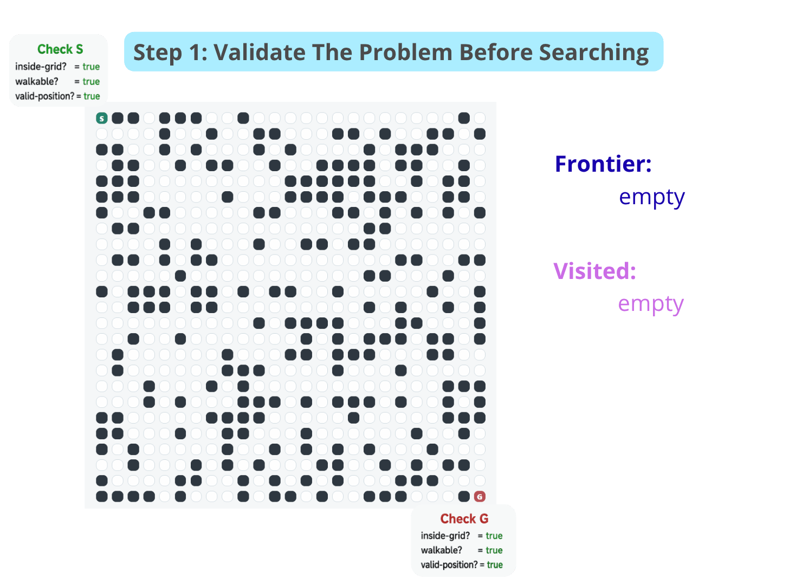

## 7.2 First Frontier

After validation, the start node is created. Its `g` value is `0`, its `h` value is the Manhattan distance to the goal, and its `f` value is `g + h`. This node becomes the first element of the frontier.

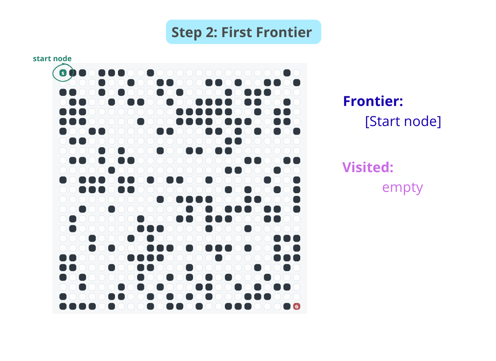

## 7.3 First Expansion

The algorithm selects the best node from the frontier using `best-node`, which reads the root of the priority queue. Since the frontier only contains the start node at the beginning, the start is selected first. Then the function `neighbors` finds the valid adjacent cells.

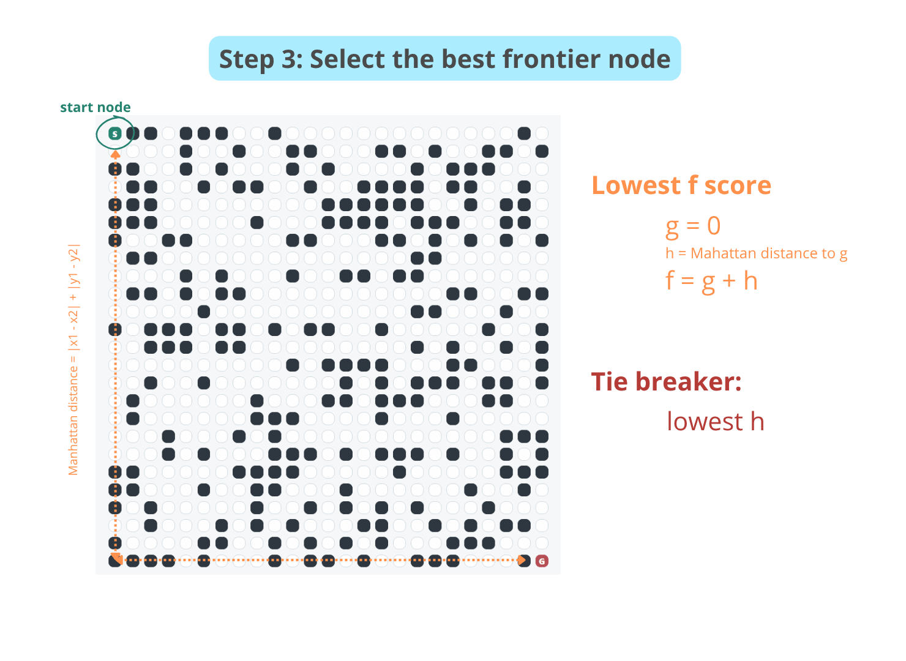

## 7.4 Middle of the Search

As the search continues, the frontier contains several possible routes. At each step, `best-node` chooses the node with the lowest `f` value from the priority queue. Then `enqueue-unvisited-neighbors` adds new nodes for valid neighbors. The visited list grows as nodes are fully processed.

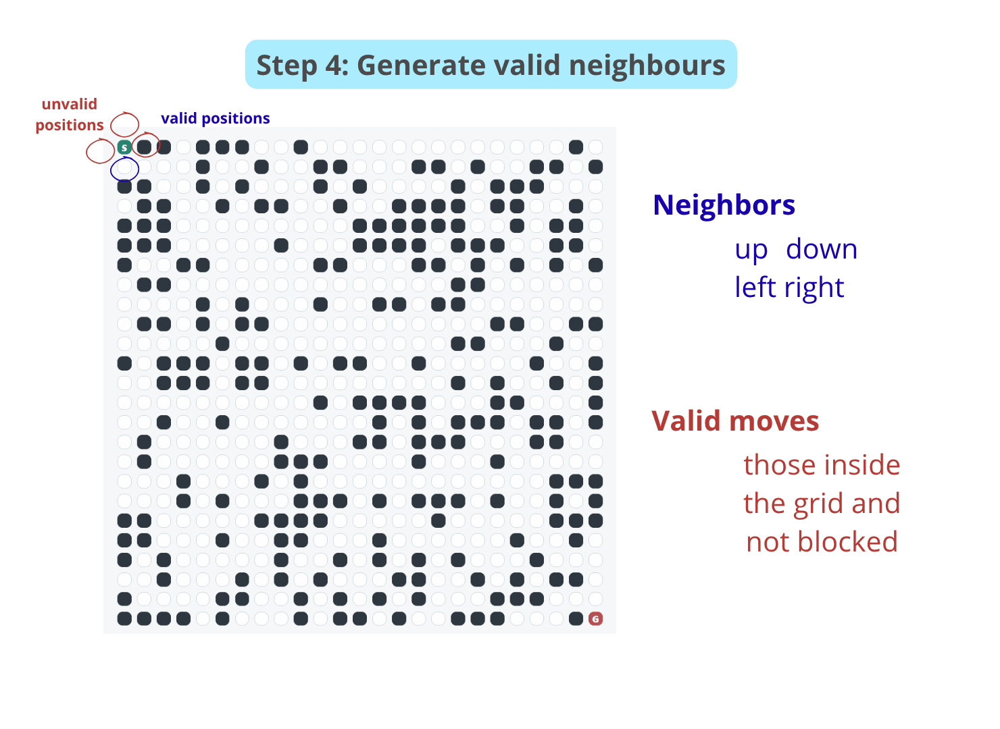

The next screenshot shows how those neighbors start changing the frontier and visited lists as the search continues.

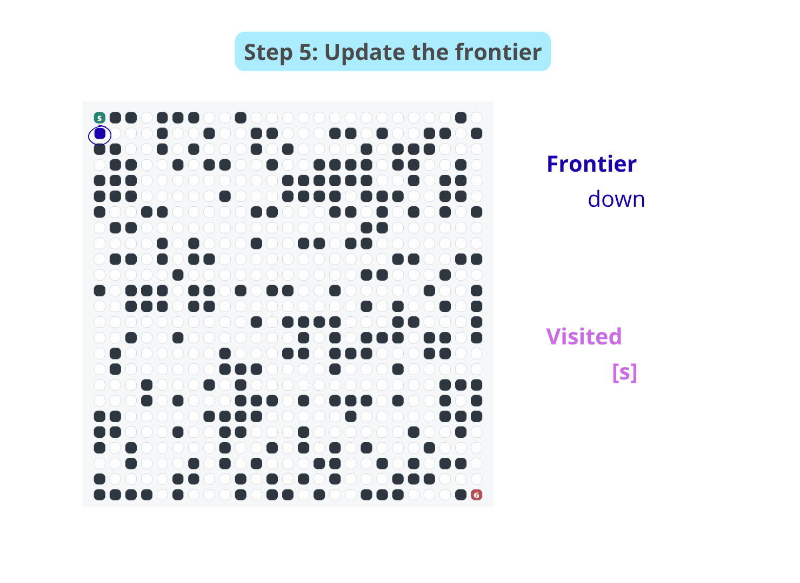

## 7.5 Finding the Goal

When the selected node is equal to the goal position, `search-from-frontier` stops expanding the frontier, before that it will continue to repeat the loop. Once the goal is reached, the algorithm has found a valid route.

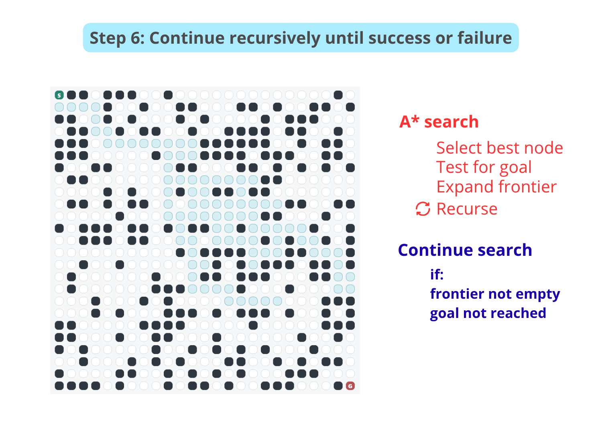

## 7.6 Path Reconstruction

Once the goal is found, `reconstruct-path` follows the parent links from the goal back to the start. The visualizer then highlights the final path.

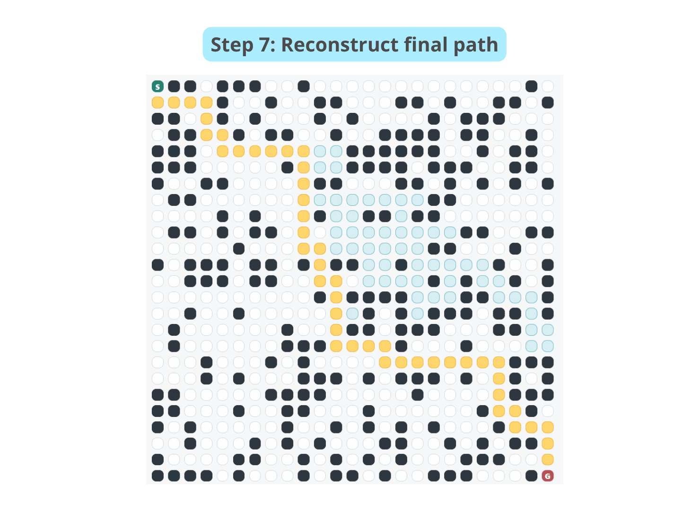

---

# 8. Diagrams

The following diagrams summarize the search flow and the main function calls used by the implementation.

## 8.1 Functional Data Flow

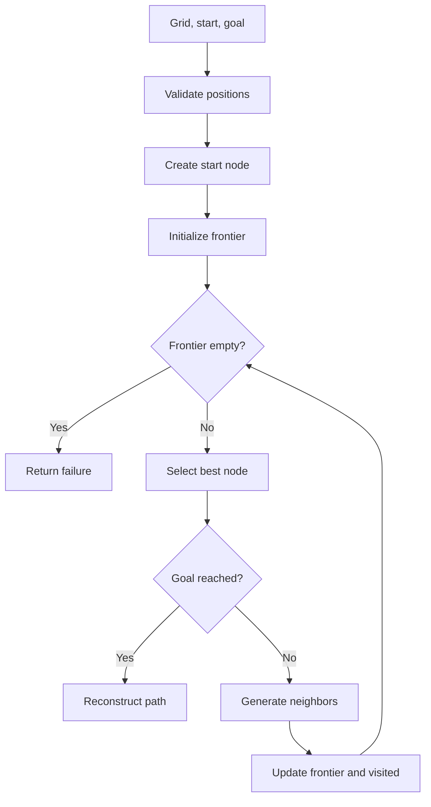
```mermaid
flowchart TD
    A["Grid, start, goal"] --> B["Validate positions"]
    B --> C["Create start node"]
    C --> D["Initialize frontier"]
    D --> E{"Frontier empty?"}
    E -->|"Yes"| F["Return failure"]
    E -->|"No"| G["Select best node"]
    G --> H{"Goal reached?"}
    H -->|"Yes"| I["Reconstruct path"]
    H -->|"No"| J["Generate neighbors"]
    J --> K["Update frontier and visited"]
    K --> E
```

## 8.2 Function Call Flow

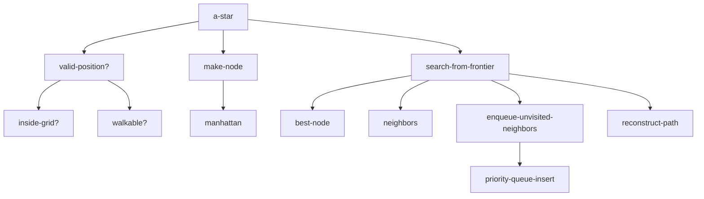
```mermaid
flowchart TD
    A["a-star"] --> B["valid-position?"]
    B --> C["inside-grid?"]
    B --> D["walkable?"]
    A --> E["make-node"]
    E --> F["manhattan"]
    A --> G["search-from-frontier"]
    G --> H["best-node"]
    G --> I["neighbors"]
    G --> J["enqueue-unvisited-neighbors"]
    J --> K["priority-queue-insert"]
    G --> L["reconstruct-path"]
```

## 8.3 Alternative Paradigm: Concurrency

Another paradigm which could be used is concurrency. In a concurrent design, several agents or several independent path requests can be processed over the same grid during the same period of execution. This does not change the A* logic for one request. Each request still needs a start position, a goal position, a frontier, visited nodes, and parent links. What changes is how multiple requests are scheduled and how their results are collected.

The grid can be shared between all threads because it is read-only during the search. No thread writes obstacles, removes cells, or changes the grid dimensions while A* is running. The search state is different: the frontier, visited list, current node, and parent links belong to one search only, so each thread keeps its own copies of those values.

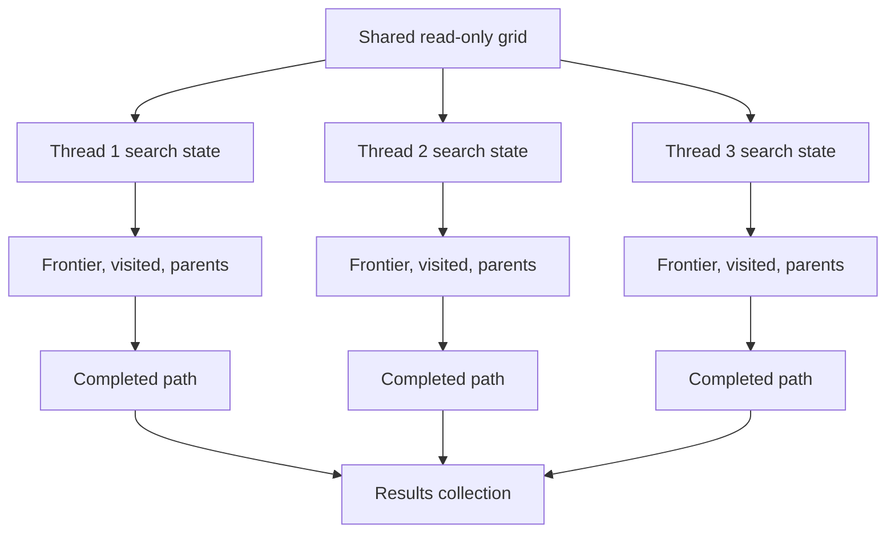
```mermaid
flowchart TD
    A["Shared read-only grid"] --> B["Thread 1 search state"]
    A --> C["Thread 2 search state"]
    A --> D["Thread 3 search state"]
    B --> E["Frontier, visited, parents"]
    C --> F["Frontier, visited, parents"]
    D --> G["Frontier, visited, parents"]
    E --> H["Completed path"]
    F --> I["Completed path"]
    G --> J["Completed path"]
    H --> K["Results collection"]
    I --> K
    J --> K
```

### Avoiding Race Conditions

The main risk in concurrency is a race condition. This can happen when two threads read and write the same changing data at the same time. In this design, the risk is reduced by separating shared data from thread-local data. The grid is shared, but it is not modified. The frontier, visited list, current node, and parent links are modified, but they are owned by one thread only.

The only shared structures that require protection are the task queue and the results collection. The task queue stores pending path requests, and the results collection stores completed paths. These structures are shared because all worker threads need to take tasks and return results. A mutual exclusion lock protects these short operations so two threads do not take the same task or write to the same result position at the same time.

### Task Queue and Thread Pool

A concurrency-based design would use a thread pool instead of creating a new thread for every path request. The thread pool keeps a fixed number of worker threads ready. Each worker takes one task from the task queue, runs A* with its own frontier and visited list, stores the completed result, and then takes another task if one is available.

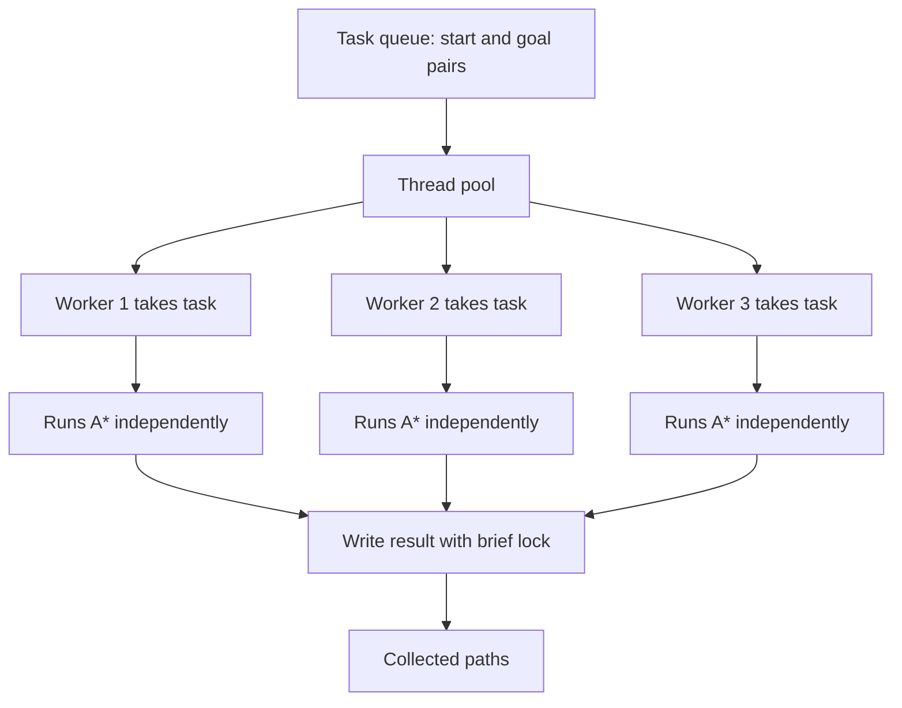
```mermaid
flowchart TD
    A["Task queue: start and goal pairs"] --> B["Thread pool"]
    B --> C["Worker 1 takes task"]
    B --> D["Worker 2 takes task"]
    B --> E["Worker 3 takes task"]
    C --> F["Runs A* independently"]
    D --> G["Runs A* independently"]
    E --> H["Runs A* independently"]
    F --> I["Write result with brief lock"]
    G --> I
    H --> I
    I --> J["Collected paths"]
```

### Data Ownership

The concurrency organization can be divided into four parts. The grid is created once and shared as read-only data. The thread pool owns the worker threads that execute searches. The task queue stores the start and goal pairs waiting to be solved. The results collection stores the finished path for each request.

The A* search inside each worker is still the same algorithm. Each worker creates its own frontier and visited list when it starts a task, follows parent links to reconstruct the result, and discards that local search state when the task finishes. This prevents one search from changing the internal state of another search.

### Execution Sequence

The concurrency implementation would begin by creating the grid and the list of path requests. Each request contains a start position, a goal position, and an identifier so the final path can be matched back to the original request. After that, the requests are placed into the task queue.

The thread pool is then started with a fixed number of workers. Each worker repeats the same loop: lock the task queue, remove one pending request, unlock the task queue, run A* for that request, lock the results collection, store the result, and unlock the results collection. When the task queue is empty, the worker stops taking new work.

```text
create grid
create task queue with start-goal requests
start worker threads

for each worker:
  take one task from the queue
  run A* with local frontier and visited list
  write completed path into results
  repeat until no tasks remain

join all worker threads
return collected paths
```

The lock around the task queue is needed only while a worker takes a task. The lock around the results collection is needed only while a worker writes the completed path. The A* search itself does not hold a lock, because the search state belongs to that worker.

### Worker State

Each worker receives the shared grid and one task. From that task, it creates the same values used by the functional version: the start node, the frontier priority queue, the visited list, and the parent links. These values are local to the worker, so another worker solving a different path request cannot change them.

For example, if three agents need paths at the same time, the task queue may contain three start-goal pairs. Worker 1 can solve the first pair, Worker 2 can solve the second pair, and Worker 3 can solve the third pair. All three workers read the same grid, but each one has a separate frontier. When they finish, each one writes one result into the shared results collection.

### Synchronization Points

There are only two synchronization points. The first one is task selection, because two workers must not receive the same request. The second one is result writing, because two workers must not write to the shared results collection at the same time. Everything between those two points is the normal A* search and does not require synchronization.

This organization keeps the concurrency paradigm focused on independent work. The search is still A*, but the program structure changes from one recursive flow into multiple worker flows coordinated by a queue.

---

# 9. Visualizer

The visualizer displays the grid, obstacles, visited cells, and final path. It also allows the user to change the grid size, obstacle density, path requirement, and playback speed.

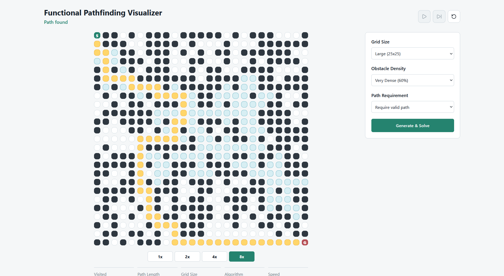

---

# 10. Testing

## 10.1 Base Cases

The Racket test file includes the base cases that are necessary to check the behavior of the algorithm. Each case checks the input condition and the result immediately:

| Test case | What is checked | Expected result | Current result |
| --- | --- | --- | --- |
| Simple path | The sample grid has a route from `sample-start` to `sample-goal`. | `success` is true, the path starts at the start cell, ends at the goal cell, uses only walkable cells, and moves one cell at a time. | Passed. |
| No solution | The goal is surrounded by obstacles. | `success` is false, `path` is empty, and the visited list begins from the start cell. | Passed. |
| Start equals goal | The start and goal are both `(0 0)`. | `success` is true, `visited` is `((0 0))`, and `path` is `((0 0))`. | Passed. |
| Invalid start | The start position is an obstacle. | `success` is false, `visited` is empty, and the error is `"Invalid start position"`. | Passed. |
| Invalid goal | The goal position is outside the grid. | `success` is false, `visited` is empty, and the error is `"Invalid goal position"`. | Passed. |

RackUnit is used for these tests because it provides direct checks such as `check-true`, `check-false`, and `check-equal?`.

## 10.2 Algorithm Effectiveness Against the Optimal Result

The project also includes an effectiveness test in:

```text
tests/bfs_compare.py
```

BFS is used only to obtain the optimal result because this grid is unweighted. Every valid movement has the same cost: one step. In an unweighted graph, BFS finds the shortest path measured by number of edges, because it explores all positions at distance `d` before exploring positions at distance `d + 1` (OpenDSA, n.d.-b). For this project, that shortest path is the perfect outcome used to evaluate A*.

The effectiveness test uses a `0%` threshold. This means that when the optimal solver finds a path, A* must return a path with exactly the same length. A longer A* path fails the test, because the heuristic should still lead to the optimal route. A shorter A* path also fails, because that would mean one of the path calculations is inconsistent.

The Python script calls `tests/astar-case-runner.rkt`, reads the A* results as JSON, calculates the optimal path for the same grids, and checks only the outcome. It does not evaluate the number of explored cells. The test checks whether A* agrees with the optimal result about reachability and, when a path exists, whether the A* path length is equal to the optimal path length.

The effectiveness test includes the five base cases and twelve generated grid cases. The generated cases use larger grids from `12x12` to `25x25`, different obstacle densities, solvable grids, blocked grids, and random grids. Each generated case uses a fixed seed, so the test runs several generated iterations while keeping the results repeatable.

RackUnit reports six test groups: five base-case groups and one optimality-validation group. The optimality-validation group contains the seventeen fixed and generated cases checked against the optimal path length.

## 10.3 Test Output

The current test command is:

```powershell
& "C:\Program Files\Racket\Racket.exe" -l raco test tests/test-astar.rkt
```

Output:

```text
Optimal-path validation tests passes 17/17 cases, 0% threshold

========================================
OK: A* TESTS PASSED
========================================
6 tests passed
```

---

# 11. Running the Project

All commands are written from the repository root.

| Purpose | Command |
| --- | --- |
| Install visualizer dependencies | `npm --prefix visualizer install` |
| Run API server | `npm --prefix visualizer run api` |
| Run visualizer | `npm --prefix visualizer run dev` |
| Build visualizer | `npm --prefix visualizer run build` |
| Run tests if Racket is in `PATH` | `raco test tests/test-astar.rkt` |
| Run tests on this Windows setup | `& "C:\Program Files\Racket\Racket.exe" -l raco test tests/test-astar.rkt` |

Open the visualizer at:

```text
http://127.0.0.1:5173/
```

The `raco test` command runs the Racket test file from the repository root.

---

# 12. Complexity Analysis

## 12.1 Functional Implementation

Let `V` be the number of cells in the grid, and let `E` be the number of valid movements between cells.

The frontier is represented as a priority queue using a leftist heap. The function `best-node` reads the root of the queue, and `remove-best-node` removes that root by merging the two child queues. Heap-based priority queues are used because they avoid scanning every frontier node just to find the next one (OpenDSA, n.d.-a).

```text
best-node: O(1)
priority-queue-insert: O(log F)
priority-queue-remove-min: O(log F)
```

`F` is the number of nodes currently stored in the frontier. Since A* may insert nodes while checking the valid movements in the grid, the priority queue part of the search is approximately:

```text
O(E log E)
```

The implementation stores the visited values as a list. This means that checking whether a position was already visited depends on the size of the visited list. A version focused on larger grids could store visited positions in a set or dictionary.

The space complexity is:

```text
O(V + F)
```

This is because the algorithm may store frontier nodes, visited nodes, parent links, and the final path. The grid itself also contains `V` cells.

## 12.2 Concurrency

In the concurrency paradigm, one A* request has the same cost as the functional implementation because the search logic is still the same. The difference appears when there are several independent path requests. If there are `R` requests, the total sequential work is approximately:

```text
O(R * E log E)
```

With `T` worker threads, those requests can be distributed across the thread pool. In an ideal case where the tasks are similar in size and the machine has enough CPU resources, the wall-clock work can be approximated as:

```text
O((R * E log E) / T)
```

This does not mean that one path becomes faster. It means that several independent path requests can progress at the same time. The task queue and results collection add synchronization work, but those operations are short compared with the search itself.

The space complexity for concurrency depends on how many searches are active at the same time. Each worker owns its own frontier, visited list, and parent links. With `T` active workers, the active search memory is approximately:

```text
O(T * (V + F))
```

The shared grid is stored once, and the task queue and results collection grow with the number of requests.

---

# 13. Paradigm Comparison

## 13.1 Functional Version

The functional version represents the search as data transformation. The important values are the frontier, the visited list, and the parent links. Each recursive call receives updated versions of these values.

This makes the reasoning of the algorithm visible. The program is not centered on an object changing internal fields. Instead, the progress of the search is shown through values passed between functions.

## 13.2 Concurrency

Where the functional paradigm shows the progress of one search through recursive calls, concurrency organizes several independent requests during the same period of execution. The grid is shared as read-only data, while each thread owns the frontier, visited list, and parent links for the task it is solving.

The central concern changes from one search state to data ownership. Thread-local values can be updated freely by the worker that owns them. Shared values, such as the task queue and results collection, must be protected when threads take new work or store completed paths. This keeps the synchronization boundary small: most of the work happens independently inside each thread.

This paradigm is more useful when the problem involves many agents or many independent path requests. For a single path, concurrency does not improve the A* logic. For many simultaneous requests, it distributes the searches across worker threads and collects the results after each task finishes.

## 13.3 Overall Comparison

| Approach | Main idea | Advantage | Limitation |
| --- | --- | --- | --- |
| Functional A* | Transform one search state through recursive calls. | Priority queue avoids scanning the whole frontier. | Visited list is still simple instead of fully optimized. |
| Concurrency | Run independent path requests through a task queue and thread pool. | Useful for many agents or many requests. | Shared queue and result collection require synchronization. |
| Optimal result validation | Finds the shortest path in the unweighted grid. | Checks that A* returns the best path length. | Only applies directly because all moves have equal cost. |

---

# 14. Conclusion

This project implements A* as a functional pathfinding algorithm in Racket. The algorithm validates the input, creates a start node, selects the best frontier node, expands valid neighbors, updates the search state, and reconstructs the final path using parent links. The implementation uses lists and recursive functions to keep the process close to the functional programming style studied in class.

The tests cover the base cases and validate A* against the optimal path length. Since every movement in the grid has the same cost, the validator can calculate the shortest path length for the same problem. This helps check that the A* result is not only valid, but also optimal for the tested grids.

The visualizer shows the same search data used by the tests: visited cells, final path, and success or failure status.

---

# References

Abelson, H., Sussman, G. J., & Sussman, J. (1996). *Structure and interpretation of computer programs* (2nd ed.). MIT Press. https://web.mit.edu/6.001/6.037/sicp.pdf

Church, A. (1936). An unsolvable problem of elementary number theory. *American Journal of Mathematics, 58*(2), 345-363. https://doi.org/10.2307/2371045

Hart, P. E., Nilsson, N. J., & Raphael, B. (1968). A formal basis for the heuristic determination of minimum cost paths. *IEEE Transactions on Systems Science and Cybernetics, 4*(2), 100-107. https://doi.org/10.1109/TSSC.1968.300136

NIST. (n.d.). *Leftist tree*. Dictionary of Algorithms and Data Structures. https://xlinux.nist.gov/dads/HTML/leftisttree.html

OpenDSA. (n.d.-a). *Heaps and priority queues*. https://opendsa.cs.vt.edu/ODSA/Books/Everything/html/Heaps.html

OpenDSA. (n.d.-b). *Shortest-paths problems*. https://opendsa.org/OpenDSA/Books/Catalog/html/GraphShortest.html

Russell, S., & Norvig, P. (2022). *Artificial intelligence: A modern approach* (4th ed.). Pearson. https://aima.cs.berkeley.edu/
